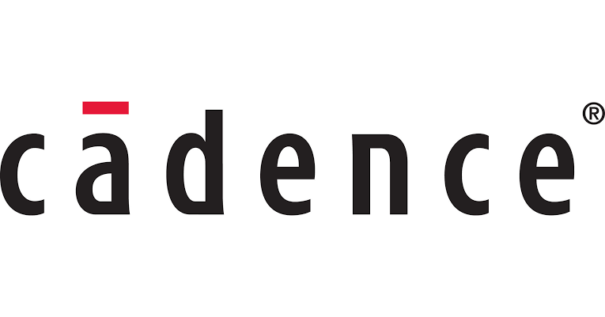
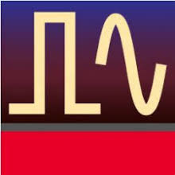
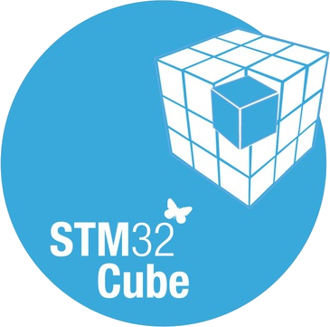
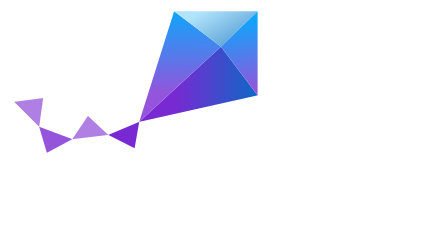

<h2 align="left">Hi there, I'm Pham Ho Anh Tuan (Pham Tuan) 👋</h2>

- 🔬 Currently working as a **Hardware Design Engineer** at **Viettel High Tech (VHT)**
- 🎓 Pursuing an **M.Sc. in Telecommunications Engineering** — Research focus on **Antenna & RF Circuit Design**
- ⚡ Specialized in **High-Speed Multi-layer PCB Design, Signal Integrity (SI), RF/Microwave Circuits, and Embedded Hardware**
- 🌱 B.Eng. in Electronics & Telecommunications at **Ho Chi Minh City University of Technology (HCMUT)**

---

### 🛠️ Hardware, RF & Embedded Tech Stack

<h4 align="left">🔌 PCB Design & Electronic Design Automation (EDA):</h4>

  &nbsp;&nbsp;&nbsp;
  &nbsp;&nbsp;&nbsp;
  

<h4 align="left">📡 RF, Antenna & Signal Integrity (SI) Simulation:</h4>

  &nbsp;&nbsp;&nbsp;
  

<h4 align="left">💻 Firmware, MCU & Development Tools:</h4>

  &nbsp;&nbsp;&nbsp;
  &nbsp;&nbsp;&nbsp;
  &nbsp;&nbsp;&nbsp;
  &nbsp;&nbsp;&nbsp;
  

<h4 align="left">⚙️ Real-Time Operating Systems (RTOS):</h4>

  &nbsp;&nbsp;&nbsp;
  

---

### 📊 GitHub Analytics & Organizations

<table width="100%">
  <tr>
    <td width="72%" align="center" valign="middle">
      
       
      
    </td>
    <td width="28%" align="center" valign="middle">
        
      <b>Viettel High Tech</b>
         
        
      <b>HCM University of Technology</b>
    </td>
  </tr>
</table>